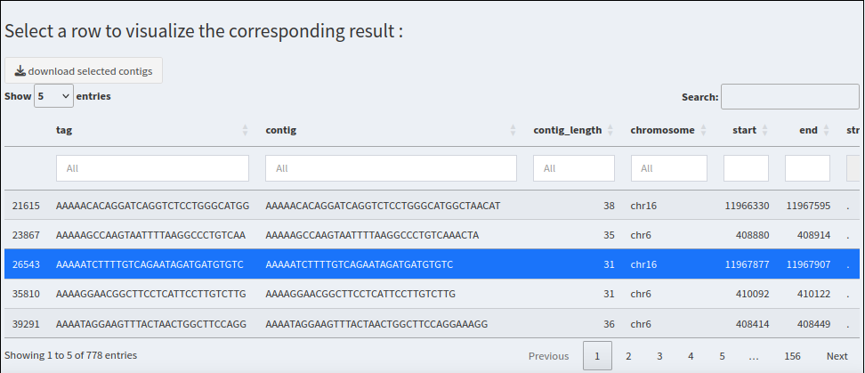

# User Guide for Shiny Application

## Introduction

Welcome to this Shiny application for contig data analysis. This
application allows you to filter contigs of your interest, visualize
their expression in different conditions and get more informations about
them.

## Main Features

-   **Custom Filtering**: Use custom filters to refine your contig
    selection.
-   **Graphical Visualization**: Get visuals to compare expression under
    different conditions.
-   **Peptides Visualization**: Display the three-frame peptides
    corresponding to the selected contig.
-   **JBrowse Integration**: Visualize your contig in JBrowse to know
    more about its environment.

## Instructions

### 1. Upload a Directory

Click the "Upload your directory" button to select and upload a
directory containing your data files.

The files you need in your directory are :

-   The alignment files :

**Aligned-fixed.out.bam Aligned-fixed.out.bam.bai**

-   The genome files :

**GRCh38.primary_assembly_genome_official_chromosomes.fa**
**GRCh38.primary_assembly_genome_official_chromosomes.fa.fai**

-   The ClinVar files :

**clinvar_20210828_gencode_chromosomes.vcf.gz**
**clinvar_20210828_gencode_chromosomes.vcf.gz.tbi**

-   The data file containing the counts of CCLE & Gtex for each contig
    (1st column : the contig's tag) :

**reads_counts_cancer_Gtex.fst**

-   The quantiles file containing the tags as 1st column and the
    quantiles of CCLE and Gtex (column pattern : "all_XXperct_CCLE" /
    "all_XXperct_Gtex") :

**cancer_normal_quantiles.fst**

-   The annotated table containing the contigs characteristics (tag,
    sequence, start/end, nb_snv, gene_biotype, median expression in
    CCLE...) :

**table_annotated.fst**

-   The file containing the names of your cancer cell lines (CCLE) :

**sample_order.txt**

-   The pattern of your cancer data :

**cancer_cols.txt**

-   The gff files for the genome browser :

**gencode.v32.annotation_sorted_official_chromosomes.gff3.gz**

**gencode.v32.annotation_sorted_official_chromosomes.gff3.gz.ix**

**gencode.v32.annotation_sorted_official_chromosomes.gff3.gz.ixx**

**gencode.v32.annotation_sorted_official_chromosomes.gff3.gz.tbi**

**gencode.v32.annotation_sorted_official_chromosomes.gff3.gz_meta.json**

-   Optionally your data file for the patients :

**reads_counts_patients.fst**

-   Optionally your quantiles file for the patients :

**patients_quantiles.fst**

### 2. File Validation

Once the directory is selected, click "validate" to validate the files.
A message will indicate whether all files are validated or if some files
are missing.

### 3. Apply Filters

Use the custom filters on the left side to refine the contig selection
according to your criteria.

Apply your filters and validate your selection by clickig on this button
:

A summary table of your selected contigs updates according to your
filters.

### 4. Display Scatterplot

Select conditions and color parameters for the scatterplot and click on
"Show scatterplot".

### 5. Contigs table

A table containing all the contigs you have selected appears when you
apply your filters.

### 6. Display Boxplot

Click on a row in the contigs table to display the boxplot of the
expression depending on the condition.

### 7. Display Peptides

Click on a row in the contigs table to display the 3 peptides
corresponding to the selected contig.

### 8. Download your visuals and tables

Click on the buttons under the boxplot and the peptides to download your
visuals and tables.

### 9. Use JBrowse (genome browser)

JBrowse is integrated for detailed visualization. Click on a row in the
table to load the contig into the browser and explore it in detail.

The browser interface is organized in 4 parts : \* the reference genome,
\* the genes from Gencode, \* the SNVs from ClinVar, \* the contig you
have selected.

**Here are a few settings to make the browser view clearer :**

1.  You can zoom out and see more of your contig's environment, use the
    zoom interface (top right of the browser).

2.  For the last part of the browser interface (your contig), you can
    remove the coverage and visualize only your contig : click on the
    three points of the subbam =\> Display types =\> Pileup display.

3.  For the reference genome, you can uncheck "Show reverse" and "Show
    translation" to only get the forward nucleotidic sequence.

